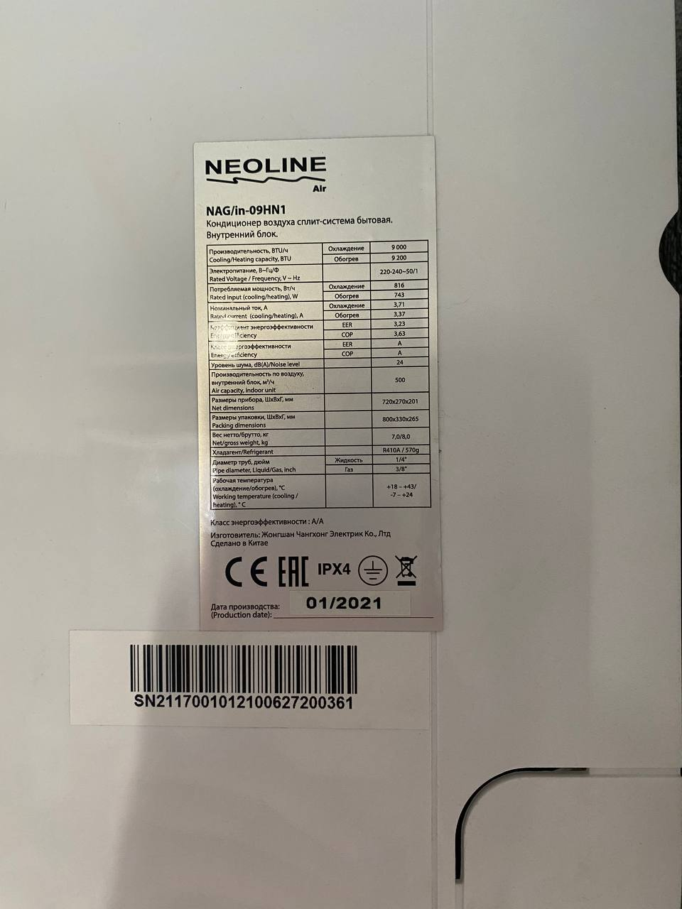
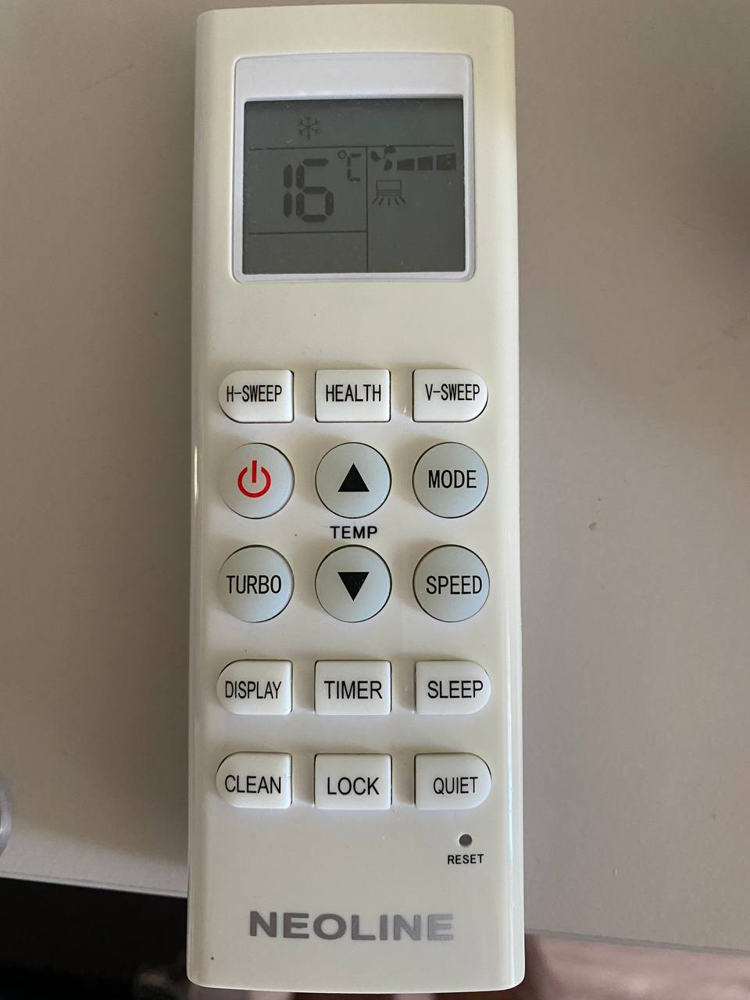
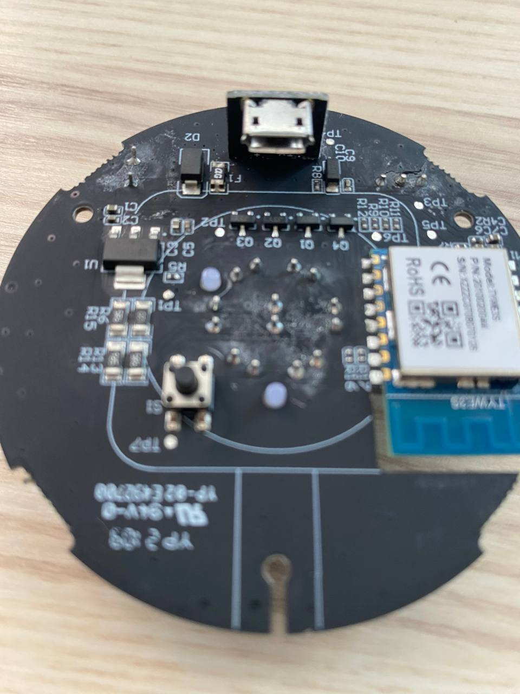
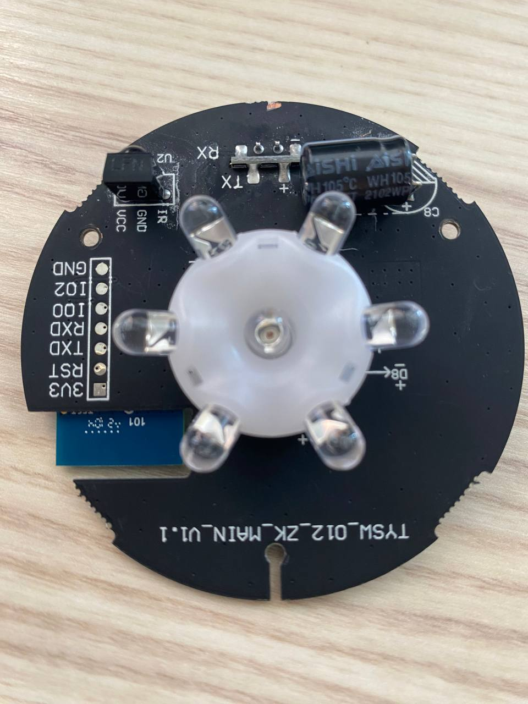
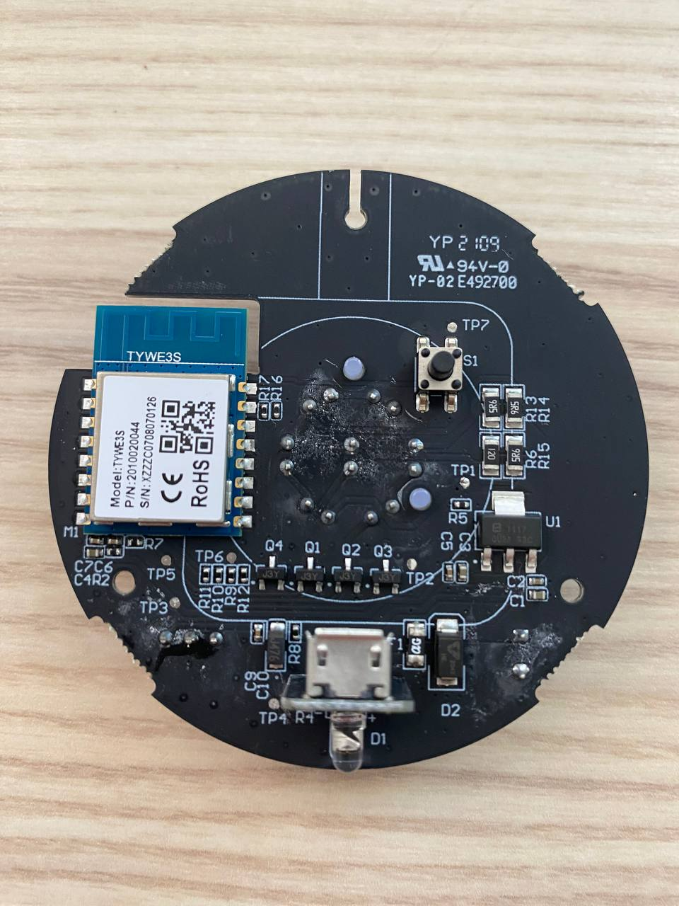
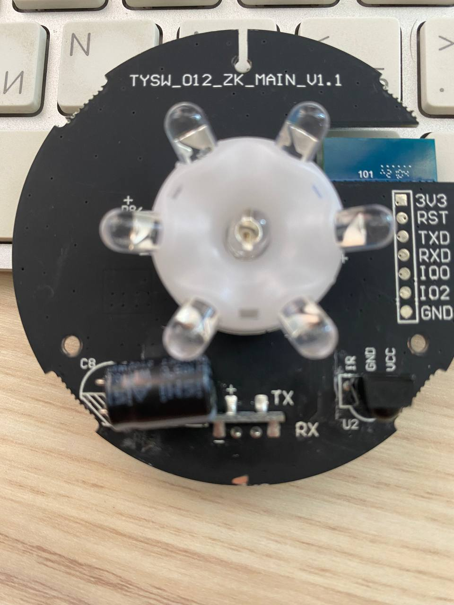

# ha_ir_esp8266

ИК-мост на ESP8266, который позволяет управлять кондиционером из Home
Assistant по MQTT (MQTT Discovery, сущность `climate`).

## Кондиционер

**NEOLINE NAG/in-09HN1**. ИК-протокол — **MIRAGE** (120 бит), подтверждено
напрямую: наведя оригинальный пульт на встроенный ИК-приёмник платы и нажав
питание, в Serial-мониторе декодировалось `protocol=MIRAGE ... bits=120`
(совпадает с `kMirageStateLength` = 15 байт). См. `include/config.h`.

(Была версия, что это OEM Midea — судя по приложению для официального
Wi-Fi модуля, "NetHome Plus", и набору функций пульта (iClean, Turbo,
Health, Quiet) — но это оказалось неверно: под тем же брендом продаются
блоки на разной начинке, поэтому единственный надёжный способ определить
протокол — поймать реальный код с пульта приёмником платы, а не судить по
косвенным признакам.)

<p>
  
  
</p>

## Плата

Целевая плата: **TYSW_012_ZK_MAIN_V1.1** — круглый Tuya ИК-пульт на голом
модуле **TYWE3S** (ESP8266EX, 1 МБ флеша). Совпадает с шаблоном Tasmota
["YTF IR Bridge"](https://tasmota.github.io/docs/devices/YTF-IR-Bridge/),
поэтому пины в `include/config.h` заданы по нему:

- `GPIO14` — кольцо ИК-светодиодов (через транзистор `U2`), передача
- `GPIO5` — встроенный ИК-приёмник
- `GPIO4` — встроенный синий светодиод статуса (активный low, пока не используется)
- `GPIO13` — встроенная кнопка (пока не используется)

<p>
  
  
  
  
</p>

На плате есть 7-пиновый разъём (`3V3 RST TXD RXD IO0 IO2 GND`, отверстия под
пайку, штырьков нет) для прошивки.

## Прошивка

### Что нужно

- Программатор с UART-мостом на 3.3В. Подойдёт обычный USB-TTL адаптер
  (CP2102/CH340/FTDI), либо дешёвые клоны **ST-Link V2 mini** — у многих из
  них помимо SWD-разъёма есть отдельный 4-пиновый UART-мост (свой чип
  USB-Serial, отдельные подписанные пины `TXD`/`RXD`/`GND`/`3.3V`). Важно:
  использовать именно эти UART-пины, а не `SWDIO`/`SWCLK` — это два разных
  протокола, SWD для ESP8266 бесполезен.
- Плата **не имеет схемы автосброса** (DTR/RTS адаптера ни к чему не
  подключены) — вход в режим прошивки делается вручную, как описано ниже.

### Подключение

Питание проще подавать через штатный micro-USB разъём платы (там есть свой
стабилизатор 3.3В), а от программатора использовать только сигнальные линии
и общую землю:

| Разъём платы | Программатор |
|---|---|
| GND | GND (обязательно — без общей земли UART не заработает) |
| TXD | RX |
| RXD | TX (именно крест-накрест) |
| IO0 | провод на GND — только на время прошивки |

`3V3`/`RST`/`IO2` можно не подключать, если плата запитана через micro-USB.

### Вход в режим прошивки

1. Замкните `IO0` на `GND` и **держите замкнутым весь сеанс** — не только
   до определения чипа, а до самого конца заливки. Если отпустить раньше,
   получите обрыв связи посреди передачи (`Invalid head of packet` и т.п.).
2. **Пока `IO0` замкнут**, вызовите сброс — нажмите кнопку `S1` на плате,
   либо переподключите питание. Просто замкнуть `IO0` на уже включённой
   плате недостаточно — нужен именно сброс/включение при замкнутом `IO0`.

### Проверка перед прошивкой (опционально, но полезно)

Убедиться, что чип отвечает, можно через `esptool` (идёт в комплекте с
PlatformIO):

```powershell
python "$env:USERPROFILE\.platformio\packages\tool-esptoolpy\esptool.py" --port COM5 --baud 115200 chip_id
```

(COM-порт смотрите в диспетчере устройств Windows; в PowerShell — именно
`$env:USERPROFILE`, а не `%USERPROFILE%`, это синтаксис `cmd.exe`.) Если
всё подключено верно, увидите `Chip is ESP8266EX` и MAC-адрес. Если пишет
`No serial data received` — не годится ни baud rate, ни программное
решение, физически проверяйте: TX/RX не перепутаны, есть общий GND,
пайка не "холодная" (прозвоните мультиметром). Секретной программной
блокировки прошивки на ESP8266 не существует (в отличие, например, от
ESP32) — если чип не отвечает, дело всегда в физике подключения.

### Заливка

```powershell
pio run -t upload --upload-port COM5
```

`board_build.flash_size` в `platformio.ini` выставлен в 1 МБ по даташиту
TYWE3S — если получите ошибку про несовпадение размера флеша, поправьте
это значение (или уточните реальный чип командой `esptool.py flash_id`).

После заливки отключите `IO0` от `GND` и сделайте ещё один сброс — плата
загрузит уже записанную прошивку в обычном режиме.

## Настройка

1. Скопируйте `include/secrets.h.example` в `include/secrets.h` и впишите
   свои данные WiFi и MQTT-брокера. Файл `secrets.h` в `.gitignore` и в
   репозиторий не попадает.
2. В `include/config.h` при необходимости скорректируйте `kAcProtocol` (по
   умолчанию `MIRAGE`, см. обоснование выше). Если команды кондиционер
   игнорирует, наведите оригинальный пульт на встроенный ИК-приёмник и
   посмотрите на реальные коды в Serial-мониторе / MQTT-топике
   `ha_ir_esp8266/<id>/learn`.
3. Соберите и залейте прошивку через PlatformIO (см. раздел "Прошивка" выше).
4. Устройство опубликует MQTT Discovery конфиг для сущности `climate` — она
   должна появиться в Home Assistant автоматически.

## MQTT-топики

Все топики с префиксом `ha_ir_esp8266/<chip-id>/`:

- `mode/set`, `mode/state` — off/auto/cool/heat/dry/fan_only
- `temp/set`, `temp/state` — целевая температура в °C
- `fan/set`, `fan/state` — auto/min/low/medium/high/max
- `availability` — online/offline (LWT)
- `learn` — JSON с любым пойманным ИК-кодом (для отладки/подбора протокола)

## Статус

Проверено на реальном железе: прошивка заливается, WiFi/MQTT подключаются,
MQTT Discovery публикуется и подхватывается Home Assistant, ИК-передатчик
физически светит (проверено камерой телефона) и шлёт валидные кадры
(подтверждено обратной самоприёмкой платы), протокол кондиционера уточнён
как `MIRAGE`. Ещё предстоит проверить, что кондиционер верно реагирует на
команды именно с этим протоколом/моделью (`kAcModel`).
